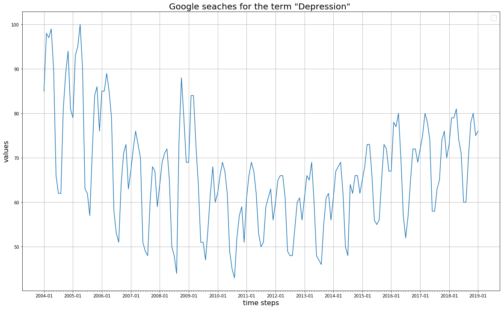
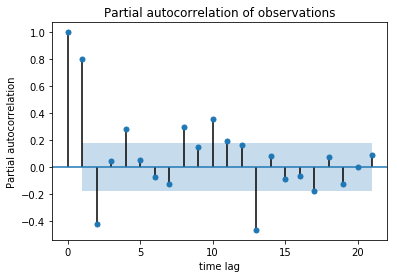
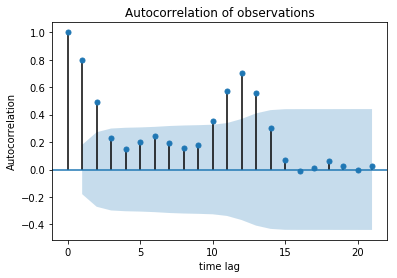
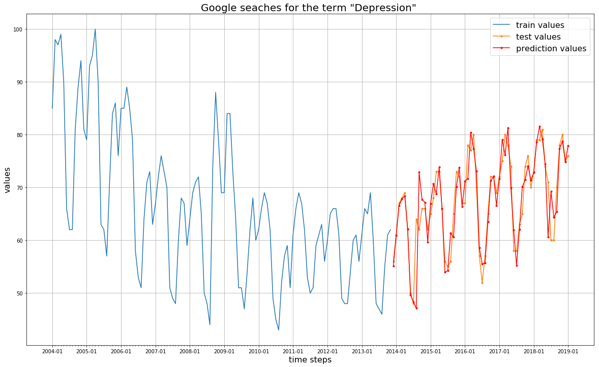

# Time Series - SARIMAX 

## Dataset description

The author of (Everybody Lies: Big Data, New Data, and What the Internet Can Tell Us About Who We Really Are)[https://www.amazon.ca/Everybody-Lies-Internet-About-Really/dp/0062390856] explore our secrets trough our Google searches.  I've thus decided to look into the Google searches on the term depression and try to predict their occurrences based on an Seasonal ARIMA model. 

The data is clearly seasonal:

It can also be seen in the Partial Auto-Correlation Function (PACF):

The Auto-Correlation Function :

## Model description

The prediction using SARIMAX(0,1,0)(0,1,1):

